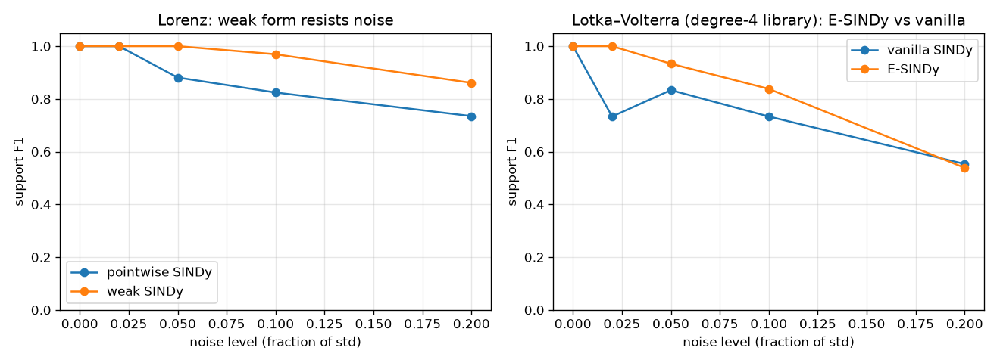
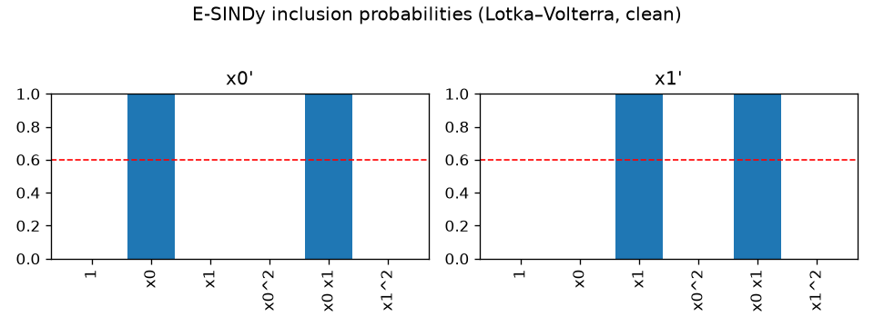
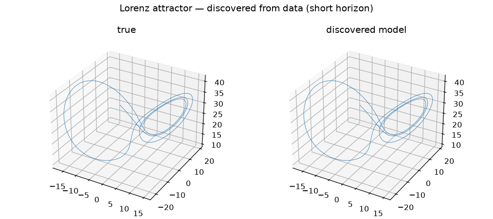

# esindy

A from-scratch, test-first implementation of **SINDy** — Sparse Identification of
Nonlinear Dynamics — and its noise-robust extensions **E-SINDy** (bootstrap ensemble)
and **weak-SINDy** (integral formulation).

You give it samples of a system's state over time; it gives you back the differential
equations governing that system, as readable formulas:

```
x' = -10.000 x + 10.000 y
y' =  28.000 x -  1.000 y - 1.000 x z
z' =  -2.667 z +  1.000 x y          ← the Lorenz system, recovered from data
```

The whole project is built around one idea: we generate data from systems whose exact
equations we already know, so every test can ask *"did we recover the true equation?"* —
a crisp, deterministic yes/no instead of a vibe.

---

## The whole story in one picture



- **Left** — the plain method works on clean data but degrades as noise rises. The
  *weak form* avoids differentiating noisy data and stays accurate much longer.
- **Right** — with a large candidate library (lots of ways to overfit), the *ensemble*
  filters out spurious terms and beats the plain method... up to a point. At very high
  noise the advantage vanishes. (We don't hide that — see [Honest findings](#honest-findings).)

*Support F1 = did we pick exactly the right terms? 1.0 means the discovered equation has
precisely the true terms and no extras.*

---

## Install

```bash
uv sync                  # core
uv sync --extra viz      # + plotting (for the figures)
uv sync --extra oracle   # + PySINDy (for the cross-validation tests)
```

## 30-second example

```python
from esindy import datasets, SINDy, STLSQ

system = datasets.get_system("lorenz")   # a system whose true equations we know
traj = datasets.simulate(system)         # generate data

model = SINDy(optimizer=STLSQ(threshold=0.5), input_names=system.state_names)
model.fit(traj.X, t=traj.t)              # discover the equations
model.print()                            # -> the Lorenz equations above
```

---

## Three methods, one interface

| Use | When | Class |
|-----|------|-------|
| `SINDy` | clean or lightly noisy data | the baseline |
| `ESINDy` | limited, noisy data + a rich candidate library | bootstraps many fits, keeps terms that show up consistently |
| `WeakSINDy` | noisy data where derivatives are the problem | never differentiates the data; integrates against smooth test functions instead |

All three take the same `fit(X, t=...)` call and expose `.coefficients_`,
`.equations()`, and `.equations_latex()`.

### What the ensemble is "sure" about

E-SINDy reports an *inclusion probability* per term — how often it survived across
bootstraps. On clean data the true terms sit at 1.0 and everything else at 0:



### It really recovers the dynamics

A model discovered from data, integrated forward, reproduces the Lorenz butterfly
(compared on a short horizon — chaotic systems diverge from *any* model long-term):



---

## How it's built (and why you can trust it)

Each piece is a small, independently testable module:

```
esindy/
  datasets.py        known systems + their exact equations  (the test oracle)
  library.py         build candidate terms: 1, x, x², x y, sin x, …
  differentiation.py estimate ẋ from x  (finite-diff, Savitzky–Golay, spline)
  optimizers.py      STLSQ — the sparse regression that drops tiny terms
  model.py           SINDy: fit / predict / simulate / equations
  ensemble.py        E-SINDy: bootstrap, aggregate, inclusion probabilities
  weak.py            weak/integral formulation
  metrics.py         did we get the right terms?  (precision / recall / F1)
  experiments.py     noise-sweep harness
  equations.py       pretty-print + LaTeX (+ parse back, for round-trip tests)
  viz.py             optional plots
```

**127 tests.** They assert things like: clean data is recovered *exactly*; a coefficient
planted just below the threshold gets dropped and just above survives; Savitzky–Golay
beats naive differentiation on noisy data; and our results match the reference library
**PySINDy to 1e-8**. The chaotic-system trap (you can't compare long trajectories) and
the basis-choice limit (no method recovers `sin` if the library only has polynomials) are
each pinned by a dedicated test.

```bash
uv run pytest                       # everything
uv run pytest -m "not slow"         # the fast loop
uv run --extra oracle pytest -m oracle   # cross-check against PySINDy
```

## Honest findings

The project deliberately surfaces where these methods *don't* shine:

1. **E-SINDy is not free robustness.** With abundant, well-sampled data it can do *worse*
   than the plain method — the bootstrap adds variance with little to gain. Its win is
   specifically the limited-data / rich-library / noisy-derivative corner (the right plot
   above, and its crossover at high noise).
2. **Parallelism only pays past ~100 bootstraps** and tops out near 3–4× on a 6-core
   chip, not 12×. Small jobs are *slower* in parallel. See
   [`docs/benchmarks.md`](docs/benchmarks.md).
3. **The threshold `λ` is not automatic** — it's the method's main usability wart.

## Reproduce the figures

```bash
uv run --extra viz python scripts/make_figures.py
```

<details>
<summary><b>Milestones (M0–M10, all complete)</b></summary>

| # | Milestone | Module |
|---|-----------|--------|
| M0 | Scaffolding & CI | tooling, `_seed.py` |
| M1 | Datasets + ground truth | `datasets.py` |
| M2 | Candidate library | `library.py` |
| M3 | Differentiation | `differentiation.py` |
| M4 | STLSQ optimizer | `optimizers.py` |
| M5 | SINDy end-to-end | `model.py`, `metrics.py` |
| M6 | Noise + breakdown baseline | `experiments.py` |
| M7 | E-SINDy (serial) | `ensemble.py` |
| M8 | Parallelization + benchmark | `ensemble.py`, `docs/benchmarks.md` |
| M9 | Equation output + viz | `equations.py`, `viz.py` |
| M10 | Weak / integral formulation | `weak.py` |
| — | PySINDy oracle validation | `tests/test_oracle.py` |

See [`docs/plan/esindy_plan.md`](docs/plan/esindy_plan.md) for the full design.
</details>

## License

MIT — see [LICENSE](LICENSE).
